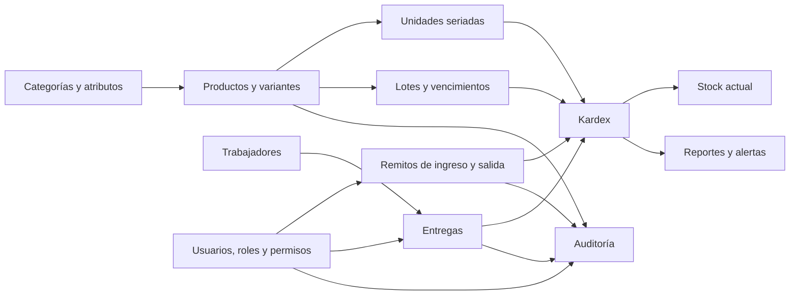
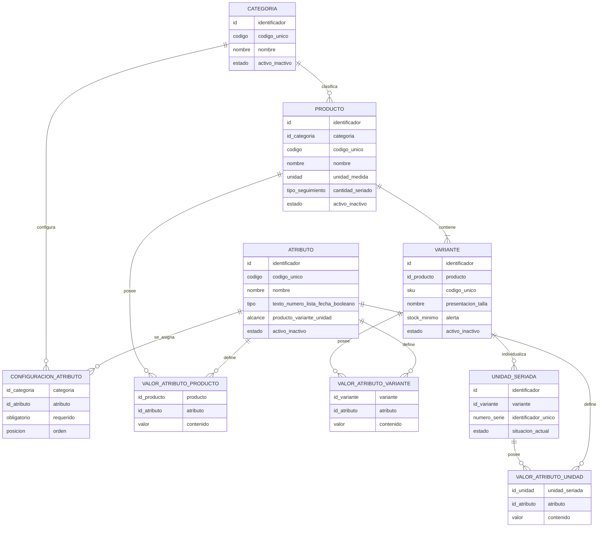
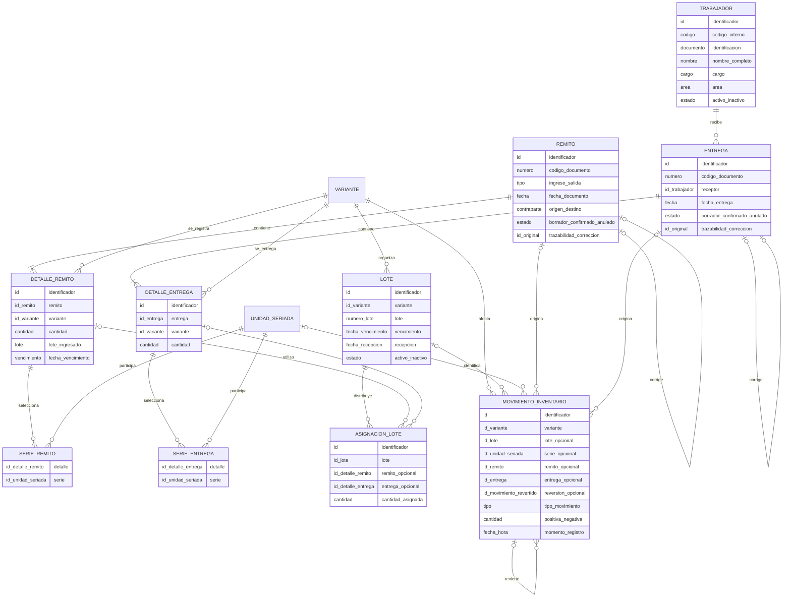
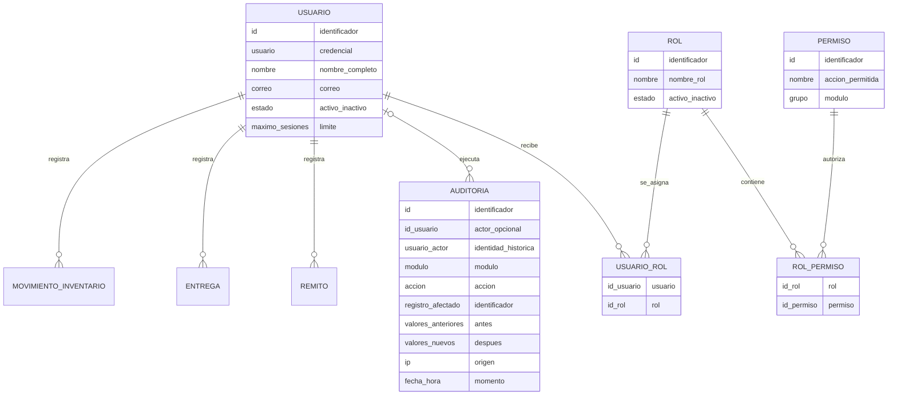

# Diagrama lógico de la base de datos

Sistema de almacén Confipetrol — modelo lógico actualizado al 20/07/2026.

Este documento representa las entidades del negocio y sus relaciones. Omite caché, sesiones, colas, migraciones y otros detalles internos de Laravel. Los nombres mostrados están en español; al final se incluye la correspondencia con las tablas físicas actuales.

## Vista general del sistema

El stock no es un dato editable: se obtiene sumando los movimientos del Kardex por variante, lote o número de serie.

## 1. Catálogo de productos

Una variante es la unidad lógica que participa en el inventario. Un producto sin tallas también tiene una variante única interna. Cuando el producto es seriado, cada equipo físico se representa mediante una unidad seriada.

## 2. Operación, lotes e inventario

### Reglas lógicas principales

- Un remito representa un ingreso o una salida del almacén.
- Una entrega representa la asignación de productos a un trabajador.
- Una asignación de lote pertenece a un detalle de remito o a un detalle de entrega, pero nunca a ambos.
- Los productos con vencimiento se entregan mediante FEFO: primero sale el lote vigente que vence antes.
- Una anulación no elimina movimientos; crea movimientos inversos relacionados con los originales.
- Una corrección conserva el documento original y registra una nueva versión.
- Una unidad seriada solamente puede tener saldo cero o uno.

## 3. Seguridad y trazabilidad

La identidad textual del actor permanece en auditoría aunque posteriormente se elimine el usuario. Los valores anteriores y nuevos permiten reconstruir qué campos cambiaron.

## Correspondencia con las tablas físicas

| Entidad lógica | Tabla física actual |
|---|---|
| Categoría | `categories` |
| Atributo | `product_attributes` |
| Configuración de atributo | `category_product_attribute` |
| Producto | `products` |
| Variante | `product_variants` |
| Unidad seriada | `serialized_items` |
| Valores de atributos | `product_attribute_values`, `variant_attribute_values`, `serialized_item_attribute_values` |
| Remito y detalle | `dispatch_notes`, `dispatch_note_items` |
| Series de remito | `dispatch_note_serialized_items` |
| Trabajador | `workers` |
| Entrega y detalle | `deliveries`, `delivery_items` |
| Series de entrega | `delivery_serialized_items` |
| Lote | `inventory_lots` |
| Asignación de lote | `inventory_lot_allocations` |
| Movimiento / Kardex | `inventory_movements` |
| Usuario | `users` |
| Rol y permiso | `roles`, `permissions` |
| Relaciones de seguridad | `model_has_roles`, `model_has_permissions`, `role_has_permissions` |
| Auditoría | `logs` |
| Secuencia documental | `document_sequences` |

Las tablas técnicas `migrations`, `cache`, `cache_locks`, `sessions`, `password_reset_tokens`, `jobs`, `job_batches` y `failed_jobs` no forman parte del diagrama lógico porque no representan procesos propios del almacén.

## Nota de simplificación

`serialized_item_attribute_values` se muestra porque existe en el esquema actual. En el uso presente duplica el número almacenado en `serialized_items.serial_number` y es candidata a eliminación si se decide que cada unidad solo necesitará número de serie. Las demás relaciones del diagrama representan funciones activas o estructuras necesarias para conservar la trazabilidad.
