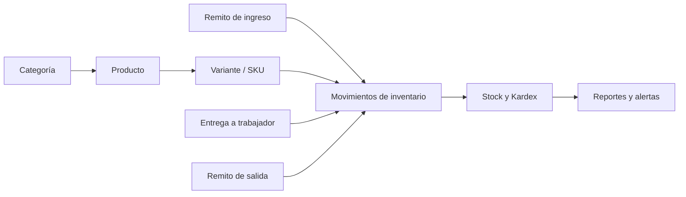

# Diagrama relacional de la base de datos

Sistema de almacén Confipetrol — esquema MySQL actualizado al 20/07/2026.

El modelo contiene 33 tablas. Para mantenerlo legible se divide en cuatro diagramas: catálogo, operación e inventario, seguridad y tablas técnicas. Los campos `created_at` y `updated_at` se omiten en algunos bloques cuando no intervienen en una relación.

## Convenciones

- `PK`: clave primaria.
- `FK`: clave foránea.
- `UK`: valor único.
- `nullable`: el campo puede quedar vacío.
- Las relaciones marcadas como lógicas no tienen una restricción física de clave foránea.
- El stock no se guarda en una columna: se calcula sumando `inventory_movements.quantity`.

## 1. Catálogo de productos y atributos

```mermaid
erDiagram
    categories ||--o{ products : clasifica
    categories ||--o{ category_product_attribute : configura
    product_attributes ||--o{ category_product_attribute : pertenece

    products ||--o{ product_attribute_values : tiene
    product_attributes ||--o{ product_attribute_values : define

    products ||--|{ product_variants : contiene
    product_variants ||--o{ variant_attribute_values : tiene
    product_attributes ||--o{ variant_attribute_values : define

    product_variants ||--o{ serialized_items : serializa
    serialized_items ||--o{ serialized_item_attribute_values : tiene
    product_attributes ||--o{ serialized_item_attribute_values : define

    categories {
        bigint id PK
        varchar name
        varchar code UK
        text description nullable
        boolean status
        bigint next_product_number
    }

    product_attributes {
        bigint id PK
        varchar name
        varchar code UK
        varchar type
        varchar scope
        json options nullable
        boolean status
    }

    category_product_attribute {
        bigint category_id PK,FK
        bigint product_attribute_id PK,FK
        boolean required
        smallint position
    }

    products {
        bigint id PK
        bigint category_id FK
        varchar code UK
        varchar name
        text description nullable
        varchar unit
        varchar tracking_type
        boolean status
    }

    product_attribute_values {
        bigint id PK
        bigint product_id FK,UK
        bigint product_attribute_id FK,UK
        text value nullable
    }

    product_variants {
        bigint id PK
        bigint product_id FK
        varchar sku UK
        varchar name nullable
        decimal minimum_stock
        boolean status
    }

    variant_attribute_values {
        bigint id PK
        bigint product_variant_id FK,UK
        bigint product_attribute_id FK,UK
        text value nullable
    }

    serialized_items {
        bigint id PK
        bigint product_variant_id FK
        varchar serial_number UK
        varchar status
    }

    serialized_item_attribute_values {
        bigint id PK
        bigint serialized_item_id FK,UK
        bigint product_attribute_id FK,UK
        text value nullable
    }
```

### Interpretación

- Una categoría configura sus atributos mediante `category_product_attribute`.
- Un atributo puede aplicarse al producto, a su variante o a una unidad serializada según `scope`.
- Un producto tiene una o varias variantes. La variante es la unidad que participa en remitos, entregas y Kardex.
- El vencimiento puede mantenerse como atributo configurable del catálogo y utilizarse en filtros y alertas, sin crear una estructura adicional de inventario.

## 2. Operación, entregas e inventario

```mermaid
erDiagram
    workers ||--o{ deliveries : recibe
    users ||--o{ dispatch_notes : registra
    users ||--o{ deliveries : registra
    users ||--o{ inventory_movements : registra

    dispatch_notes o|--o| dispatch_notes : corrige
    deliveries o|--o| deliveries : corrige

    dispatch_notes ||--|{ dispatch_note_items : contiene
    product_variants ||--o{ dispatch_note_items : referencia

    deliveries ||--|{ delivery_items : contiene
    product_variants ||--o{ delivery_items : referencia

    dispatch_note_items ||--o{ dispatch_note_serialized_items : selecciona
    serialized_items ||--o{ dispatch_note_serialized_items : participa
    delivery_items ||--o{ delivery_serialized_items : selecciona
    serialized_items ||--o{ delivery_serialized_items : participa

    product_variants ||--o{ inventory_movements : afecta
    serialized_items o|--o{ inventory_movements : identifica
    dispatch_notes o|--o{ inventory_movements : origina
    deliveries o|--o{ inventory_movements : origina
    inventory_movements o|--o{ inventory_movements : revierte

    users {
        bigint id PK
        varchar login UK
    }

    workers {
        bigint id PK
        varchar code UK "nullable"
        varchar document UK
        varchar name
        varchar lastname
        varchar position nullable
        varchar area nullable
        varchar phone nullable
        varchar email UK "nullable"
        date start_date nullable
        text notes nullable
        boolean status
    }

    dispatch_notes {
        bigint id PK
        bigint corrected_from_id FK,UK "nullable"
        varchar number UK "nullable"
        enum type "entry | exit"
        date document_date
        varchar counterparty
        varchar reason nullable
        text notes nullable
        enum status "draft | confirmed | annulled"
        bigint created_by FK
        bigint confirmed_by FK "nullable"
        bigint annulled_by FK "nullable"
        timestamp confirmed_at nullable
        timestamp annulled_at nullable
        varchar annul_reason nullable
    }

    dispatch_note_items {
        bigint id PK
        bigint dispatch_note_id FK
        bigint product_variant_id FK
        decimal quantity
        varchar notes nullable
    }

    dispatch_note_serialized_items {
        bigint dispatch_note_item_id PK,FK
        bigint serialized_item_id PK,FK
    }

    deliveries {
        bigint id PK
        bigint corrected_from_id FK,UK "nullable"
        varchar number UK "nullable"
        bigint worker_id FK
        date delivery_date
        varchar reason nullable
        text notes nullable
        enum status "draft | confirmed | annulled"
        bigint created_by FK
        bigint confirmed_by FK "nullable"
        bigint annulled_by FK "nullable"
        timestamp confirmed_at nullable
        timestamp annulled_at nullable
        varchar annul_reason nullable
    }

    delivery_items {
        bigint id PK
        bigint delivery_id FK
        bigint product_variant_id FK
        decimal quantity
        varchar notes nullable
    }

    delivery_serialized_items {
        bigint delivery_item_id PK,FK
        bigint serialized_item_id PK,FK
    }

    inventory_movements {
        bigint id PK
        bigint product_variant_id FK
        bigint serialized_item_id FK "nullable"
        bigint dispatch_note_id FK "nullable"
        bigint delivery_id FK "nullable"
        bigint reversal_of_id FK "nullable"
        varchar movement_type
        decimal quantity
        timestamp occurred_at
        bigint created_by FK
    }

    product_variants {
        bigint id PK
        bigint product_id FK
        varchar sku UK
    }

    serialized_items {
        bigint id PK
        bigint product_variant_id FK
        varchar serial_number UK
        varchar status
    }
```

### Reglas de integridad operacional

- Las entradas crean saldo positivo; las salidas y entregas crean saldo negativo.
- Las anulaciones y correcciones generan nuevos movimientos. No eliminan el movimiento original.
- `reversal_of_id` identifica exactamente qué movimiento fue revertido.
- `corrected_from_id` conserva la relación entre un documento original y su versión corregida.

## 3. Usuarios, roles, permisos y auditoría

```mermaid
erDiagram
    roles ||--o{ role_has_permissions : recibe
    permissions ||--o{ role_has_permissions : asigna

    roles ||--o{ model_has_roles : asigna
    users ||--o{ model_has_roles : relacion_logica

    permissions ||--o{ model_has_permissions : asigna
    users ||--o{ model_has_permissions : relacion_logica

    users o|--o{ logs : ejecuta
    users o|--o{ sessions : inicia
    users o|--o{ password_reset_tokens : solicita

    users {
        bigint id PK
        varchar login UK
        varchar name
        varchar lastname nullable
        varchar document UK
        varchar phone nullable
        varchar email UK
        varchar image nullable
        timestamp email_verified_at nullable
        varchar password
        boolean status
        tinyint max_sessions
        varchar remember_token nullable
    }

    roles {
        bigint id PK
        varchar name UK
        varchar guard_name UK "clave única compuesta"
        boolean status
    }

    permissions {
        bigint id PK
        varchar name UK
        varchar grupo
        varchar guard_name UK "clave única compuesta"
    }

    role_has_permissions {
        bigint permission_id PK,FK
        bigint role_id PK,FK
    }

    model_has_roles {
        bigint role_id PK,FK
        varchar model_type PK
        bigint model_id PK "logical user id"
    }

    model_has_permissions {
        bigint permission_id PK,FK
        varchar model_type PK
        bigint model_id PK "logical user id"
    }

    logs {
        bigint id PK
        bigint user_id FK "nullable"
        varchar actor_login nullable
        varchar modulo nullable
        varchar accion nullable
        text descripcion nullable
        bigint modelo_id nullable
        text valores_anteriores nullable
        text valores_nuevos nullable
        varchar ip nullable
        timestamp created_at nullable
    }

    sessions {
        varchar id PK
        bigint user_id "logical FK nullable"
        varchar ip_address nullable
        text user_agent nullable
        longtext payload
        int last_activity
    }

    password_reset_tokens {
        varchar email PK "logical user email"
        varchar token
        timestamp created_at nullable
    }
```

### Notas de seguridad

- `logs.user_id` usa `NULL ON DELETE`; `actor_login` conserva quién realizó la acción aunque el usuario sea eliminado.
- `model_has_roles`, `model_has_permissions`, `sessions` y `password_reset_tokens` se relacionan lógicamente con usuarios, pero no todas esas relaciones poseen una clave foránea física.
- `valores_anteriores` y `valores_nuevos` almacenan las diferencias auditadas en formato JSON serializado.

## 4. Tablas técnicas de Laravel

```mermaid
erDiagram
    document_sequences {
        varchar key PK
        bigint next_number
        timestamp created_at nullable
        timestamp updated_at nullable
    }

    migrations {
        int id PK
        varchar migration
        int batch
    }

    cache {
        varchar key PK
        mediumtext value
        int expiration
    }

    cache_locks {
        varchar key PK
        varchar owner
        int expiration
    }

    jobs {
        bigint id PK
        varchar queue
        longtext payload
        tinyint attempts
        int reserved_at nullable
        int available_at
        int created_at
    }

    job_batches {
        varchar id PK
        varchar name
        int total_jobs
        int pending_jobs
        int failed_jobs
        longtext failed_job_ids
        mediumtext options nullable
        int cancelled_at nullable
        int created_at
        int finished_at nullable
    }

    failed_jobs {
        bigint id PK
        varchar uuid UK
        text connection
        text queue
        longtext payload
        longtext exception
        timestamp failed_at
    }
```

`document_sequences` controla la numeración automática diaria de remitos y entregas. Las demás tablas pertenecen a migraciones, caché y procesamiento de trabajos internos.

## Respaldos

Los respaldos no tienen una tabla relacional. Se almacenan como archivos SQL en `storage/app/backups`, acompañados por su archivo de integridad SHA-256. Las restauraciones mantienen un registro independiente en `storage/logs/restore-audit.log`.

## Flujo resumido del inventario


